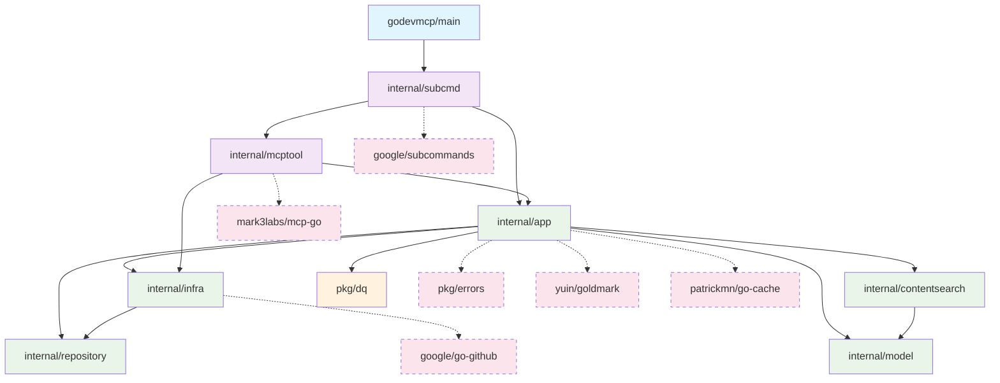

# GoDevMCP

## Introduction

GoDevMCP is a Model Context Protocol (MCP) server that provides development tools with a focus on Go, and additional support for Rust and Python. It offers documentation lookup, code search, project navigation, and more.

## Installation

### Prerequisites

- GitHub `gh` command is required.

### Using go install

You can install GoDevMCP directly using Go's install command:

```bash
go install github.com/fpt/go-dev-mcp/godevmcp@latest
```

This will download, compile, and install the binary to your `$GOPATH/bin` directory (typically `~/go/bin`). Make sure this directory is in your system's PATH.

### Building from Source

1. Clone the repository
2. Run `make build` to build the application and `make install` to install.

## MCP setup

### Claude code

Run this command to add to user scope
```
claude mcp add godevmcp -s user godevmcp serve
```

### VSCode

Add this section in your user's `settings.json`
```
    "mcp": {
        "servers": {
            "go-dev-mcp": {
                "type": "stdio",
                "command": "godevmcp",
                "args": [
                    "serve"
                ],
            }
        }
    }
```

## Tools

### Go Documentation

| Tool | Description |
|------|-------------|
| `search_godoc` | Search for Go packages on pkg.go.dev |
| `read_godoc` | Read Go package documentation with line-based paging |
| `search_within_godoc` | Search for keywords within a specific Go package's documentation |
| `outline_go_package` | Get a comprehensive outline of a Go package: dependencies, exported declarations, and call graph |
| `validate_go_code` | Validate Go code using go vet, build checks, formatting, and module tidiness |

### Rust Documentation

| Tool | Description |
|------|-------------|
| `search_rustdoc` | Search for Rust crates on docs.rs |
| `read_rustdoc` | Read Rust crate documentation with line-based paging |
| `search_within_rustdoc` | Search for keywords within a specific Rust crate's documentation |

### Python Documentation

| Tool | Description |
|------|-------------|
| `search_pydoc` | Search Python standard library modules on docs.python.org |
| `read_pydoc` | Read Python standard library module documentation with line-based paging |
| `search_within_pydoc` | Search for keywords within a specific Python module's documentation |

### Project Navigation

| Tool | Description |
|------|-------------|
| `tree_dir` | Display local directory tree structure with depth limiting |
| `search_local_files` | Search file contents in local directories with match limiting |
| `scan_markdown` | Scan markdown files to extract headings with line numbers |

### GitHub Integration

| Tool | Description |
|------|-------------|
| `search_github_code` | Search code in GitHub repositories with compact formatting |
| `get_github_content` | Get file content from GitHub with line-based paging |
| `tree_github_repo` | Display GitHub repository tree structure with depth limiting |

## Instructions

1. **Build the application**
   ```
   make build
   ```

2. **Run the application**
   ```
   make run
   ```

## Available Make Commands

- `make run` - Run the application
- `make build` - Build the application and install to ~/bin
- `make test` - Run unit tests
- `make fmt` - Format code using gofumpt
- `make lint` - Run golangci-lint
- `make inspect` - Run in MCP inspector
- `make help` - Display help information

## Development

### Project Structure

```
.
├── godevmcp/       # Application entry point
│   └── main.go     # Main application entry point
├── doc/            # Documentation files
├── internal/       # Private application and library code
│   ├── app/        # Application core functionality
│   ├── infra/      # Infrastructure code
│   ├── mcptool/    # MCP tooling implementations
│   ├── repository/ # Repository implementations
│   └── subcmd/     # Subcommand implementations
├── output/         # Build artifacts
│   └── godevmcp    # Compiled binary
├── pkg/            # Public library code
│   └── dq/         # Document query utility package
├── Makefile        # Build automation
├── go.mod          # Go module definition
└── go.sum          # Go module checksum
```

### Package Dependencies

The following Mermaid graph shows the internal package dependencies within the project:



This graph illustrates:
- **Entry Point**: `main` package coordinates subcommands
- **Core Layer**: `subcmd` (CLI) and `mcptool` (MCP server) provide user interfaces
- **Application Layer**: `app` contains business logic, supported by infrastructure packages
- **Infrastructure Layer**: Shared utilities and external integrations
- **External Dependencies**: Key third-party packages (shown with dashed lines)

### Common Development Workflow

1. Make changes to the code
2. Run `make fmt` to format code
3. Run `make lint` to check for issues
4. Run `make test` to ensure tests pass
5. Build with `make build`

### For AI Development

- Follow instructions in CONTRIBUTING.md
- Use `run_make` and `tree_dir` tools rather than using shell commands.
- Use `search_godoc` and `read_godoc` tools to understand how to use Go packages.
- Use `search_rustdoc` and `read_rustdoc` tools for Rust crate documentation.
- Use `search_pydoc` and `read_pydoc` tools for Python standard library documentation.
- Use `tree_github_repo`, `search_github_code`, `get_github_content` to inspect github repository.
- Remember to update README.md when making significant changes
